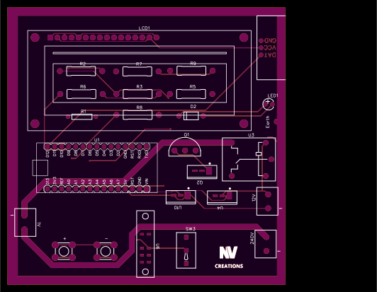
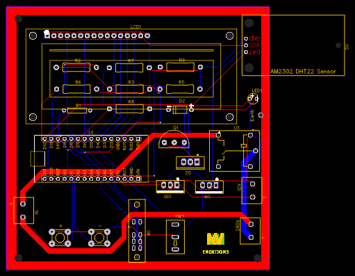
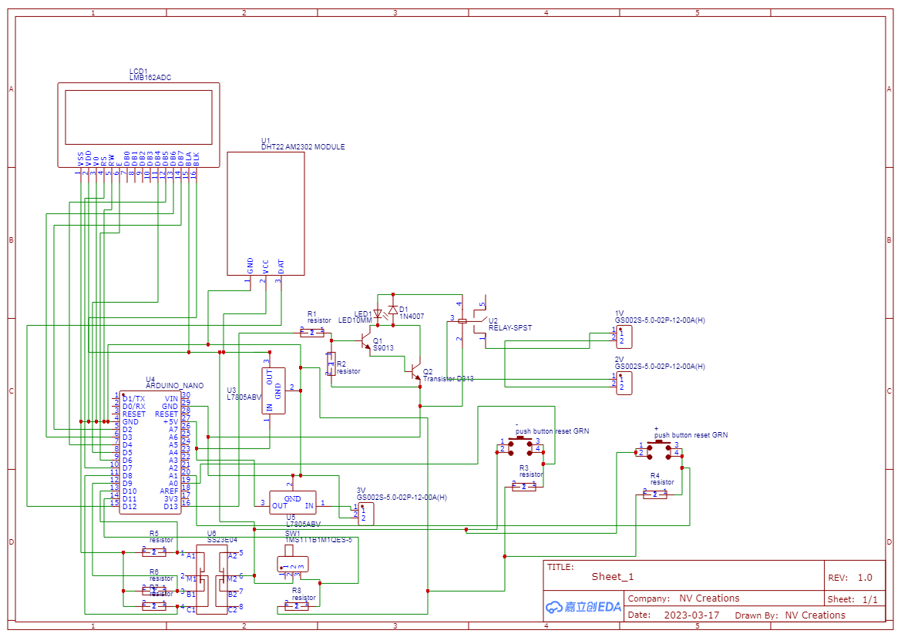

# NV-SmartEnv-Controller

A compact, standalone temperature and humidity monitoring and control unit built using Arduino Nano.  
This module allows users to view real-time environmental data on an LCD screen and configure output control (like fan, heater, humidifier, etc.) based on custom thresholds — **without** needing to reprogram the microcontroller or connect to a PC.

---

## 📦 Project Overview

This repository contains the complete project for **NV-SmartEnv-Controller**, including:

| File/Folder               | Description |
|---------------------------|-------------|
| `SmartEnv.ino`            | Arduino code (menu-based, fully manual control) |
| `EasyEDA.json`            | EasyEDA design file |
| `Gerber.zip`              | Gerber file zip for PCB manufacturing |
| `top-view.svg`            | SVG rendering of PCB top view |
| `schematic.png`           | Schematic circuit diagram |
| `pcb-preview.png`         | PNG view of the PCB layout |
| `layout.png`              | PCB Layout |
| `README.md`               | This documentation |
| `LICENSE`                 | License information (CC BY-NC-SA 4.0) |

---

## 🛠️ Key Features

- 📟 **16×2 LCD** displays real-time temperature and humidity
- 📌 Onboard buttons to set ON/OFF triggers for:
  - Minimum and maximum temperature
  - Minimum and maximum humidity
- ⚙️ Automatically switches attached equipment (fan, relay, motor, etc.)
- 🔒 Fully **manual setup** — no PC or reprogramming required after upload
- 📐 PCB size: **100mm × 100mm**
- 🔋 Designed for embedded or portable environments

---

## 🧾 Usage Instructions

1. Upload the `SmartEnv.ino` sketch to your Arduino Nano
2. Assemble the circuit using the provided PCB and components
3. Use onboard buttons to set threshold values
4. Connect output devices to the control terminals

---

## 📷 Previews

| PCB Top View | PCB Layout | Schematic Diagram |
|--------------|------------|-------------------|
|  |  |  |

---

## 📄 License

This project is licensed under the  
**[Creative Commons Attribution-NonCommercial-ShareAlike 4.0 International](https://creativecommons.org/licenses/by-nc-sa/4.0/)**

- ✅ Free to use and modify for **personal and educational** purposes
- ❌ **Commercial use not permitted**
- 🔁 Derivatives must use the same license
- ✏️ Credit must be given to the original creator

---

Made with care by **NV Creations**  
_Freelance Developer | PCB Designer | Problem Solver_
